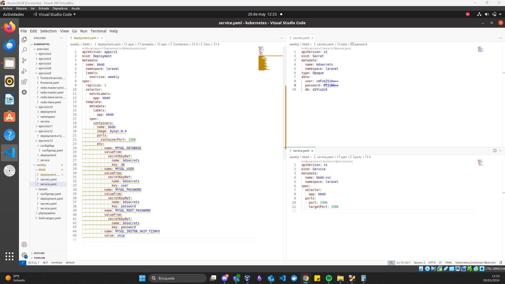
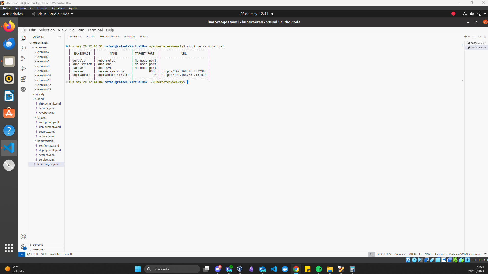

# Ejercicio semanal

## Se crean los ``namespace`` necesarrios

## Recursos del ``namespace`` laravel

## Recursos del ``namespace`` phpmyadmin

## Se crean los límites para los recursos

## Se hace el ``apply`` para crear todos los recursos y se listan

## Comprobamos los límites de los recursos

## Listamos los servicios y accedemos a ellos

